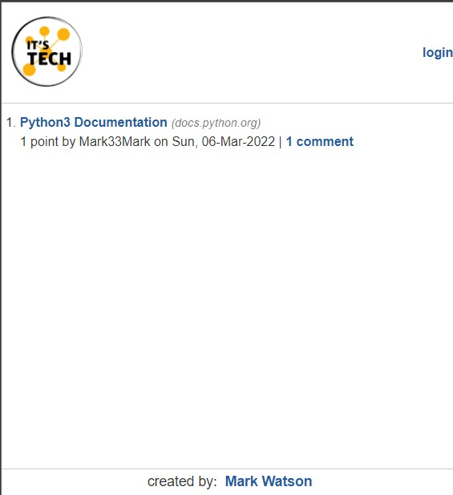
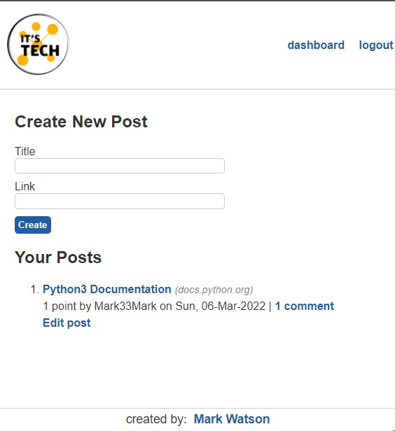
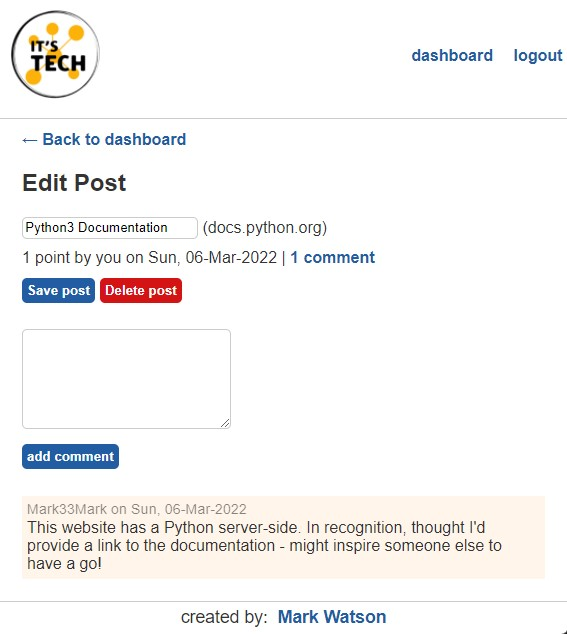

[](https://its-tech.herokuapp.com)  [](https://github.com/Mark33Mark/newsfeed-python-server)  


## it's-tech blog using Python

### Table of Contents  
  
   1. [Project Description](#1-description)
   2. [User Story](#2-user-story)
   3. [Acceptance Criteria](#3-acceptance-criteria)
   4. [Installation](#4-installation)
   5. [Usage](#5-usage)
   6. [Credits](#6-credits)
   7. [License](#7-license)
   8. [Repository Status](#8-github-repo-status)
   9. [Contribute](#9-how-to-contribute)
   10. [Tests](#10-tests)
   11. [Checklist](#11-checklist)

---

### 1. Description  

**What is this project?**  

*  Simple application for cat lovers to review the 60+ breeds known in the world.  
   
   [Live application:  its-tech.herokuapp.com](https://its-tech.herokuapp.com)  

     

**Why this project?**  

* Refactored code from a Nodejs server to Python.  This was done to demonstrate my understanding of the Python programming language - all about those indents and decorating functions!

---

### 2. User Story  

* AS a technology enthusiast 
* I WANT a place to provide links to technology websites for others to comment on
* SO THAT I can have a network of people also interested in technology.  


### 3. Acceptance Criteria

* GIVEN a landing page I see past post articles and a login link in the header  
* WHEN I select login, I am taken to a login page that also includes a sign up option as well  
* WHEN I log in or sign up I am taken to my dashboard page where I can see my past posts, comments, votes
* WHEN I select any of my posts I am taken to an edit page where I can delete the post, edit it's comments or make a comment
* WHEN I go to the main page I can select other user's posts and make comments and up vote the post.

---

### 4. Installation

You are welcome to download the source code from [my Github repository](https://github.com/Mark33Mark/newsfeed-python-server)  

Once downloaded, confirm you have python version 3.8 or greater installed (type python --version in your terminal if you are unsure).  Once confirmed run the following commands:  

```python -m venv venv```  
```./venv/Scripts/activate```  

To run the application, type in the command line:

```python -m flask run```  

Enjoy.  

---

### 5. Usage  

The code can be downloaded from [my Github repository](https://github.com/Mark33Mark/newsfeed-python-server) for all assets created for the project.  

You are welcome to modify the code as you need as allowed by the [license](#7-license)

---

### 6. Credits  
 
* University of Sydney Coding Bootcamp for providing the codebase and walkthrough to create the app.  

---

### 7. License  

 The works in this repository are subject to:  

[](doc/LICENSE.md)

---

### 8. Github repo status  


---

### 9. How to Contribute  

 If you would like to contribute, please comply with the Contributor Covenant Code of Conduct:  

[](doc/code_of_conduct.md)

---

### 10. Tests  

* No unit tests have been created, I will set up some tests for the Python server soon.

---

### 11. Checklist  

 All actions not checked are still to be completed:  

[x]  This application satisfies the following acceptance criteria:  
   - view the home and dashboard pages in the browser  
   - the database stores user accounts, posts, comments, or upvotes
   - anyone accessing the app are able to see posts on the homepage
   - posts are dated, have URLs, and plural words are properly formatted
   - logged-in users can create new posts and comments and upvote other posts
[x]  Application is deployed to Heroku [its-tech.herokuapp.com](https://its-tech.herokuapp.com).  
[x]  Application loads with no errors.  
[x]  User experience is intuitive and easy to navigate.  
[x]  User interface style is clean and polished.  
[x]  GitHub repository contains application code.  
[x]  Application is deployed to GitHub Pages: [Github location: https://github.com/Mark33Mark/newsfeed-python-server](https://github.com/Mark33Mark/newsfeed-python-server)  
[x]  Repository has a unique name.  
[x]  Repository follows best practices for class/id naming conventions, indentation, quality comments, etc.  
[x]  Repository contains multiple descriptive commit messages.  
[x]  Repository contains quality README file with description, screenshot, and link to deployed application: [Github location: https://github.com/Mark33Mark/newsfeed-python-server](https://github.com/Mark33Mark/newsfeed-python-server).  

---

[Back to the top](#its-tech-blog-using-python)  
